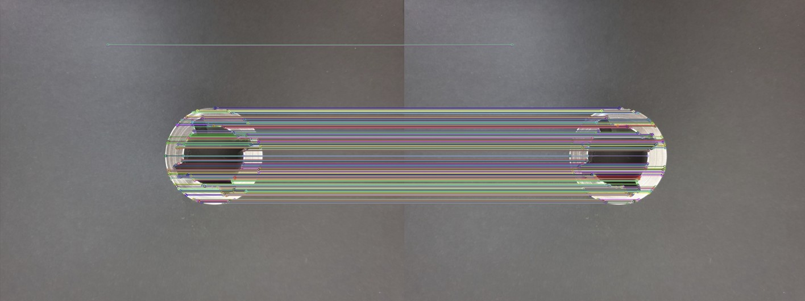
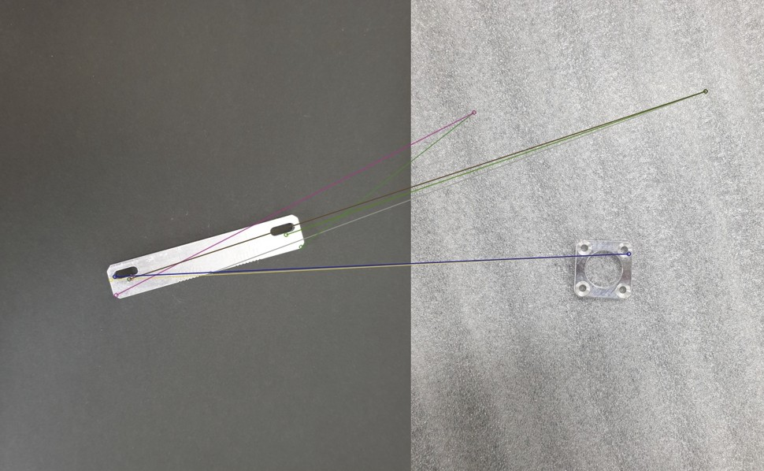

# 금속 부품 이미지 판별

조명/각도/배경이 달라진 금속 부품 이미지를 **OpenCV ORB 특징 매칭**으로 비교해 같은 부품인지 판별한 전통 컴퓨터 비전 프로젝트입니다.

<p align="center">
  
  
</p>

## 데이터
- 위치(로컬): `C:\opencv\img`
- 파일명 규칙: `A0.jpg ~ D9.jpg` (예: A5.jpg)

## 실행 방법
```bash
# 가상환경/패키지 설치 후
pip install -r requirements.txt

# 스크립트 실행 
python Opencv.py

(opencv) C:\Users\LHE>C:/Users/test/envs/opencv/python.exe c:/opencv/Opencv.py

표본 : A5.jpg
C:/opencv/img/A0.jpg    X       C:/opencv/img/B0.jpg    X       C:/opencv/img/C0.jpg    X       C:/opencv/img/D0.jpg    X
C:/opencv/img/A1.jpg    X       C:/opencv/img/B1.jpg    X       C:/opencv/img/C1.jpg    X       C:/opencv/img/D1.jpg    X
C:/opencv/img/A2.jpg    O       C:/opencv/img/B2.jpg    X       C:/opencv/img/C2.jpg    X       C:/opencv/img/D2.jpg    X
C:/opencv/img/A3.jpg    X       C:/opencv/img/B3.jpg    X       C:/opencv/img/C3.jpg    X       C:/opencv/img/D3.jpg    X
C:/opencv/img/A4.jpg    O       C:/opencv/img/B4.jpg    X       C:/opencv/img/C4.jpg    X       C:/opencv/img/D4.jpg    X
C:/opencv/img/A5.jpg    O       C:/opencv/img/B5.jpg    X       C:/opencv/img/C5.jpg    X       C:/opencv/img/D5.jpg    X
C:/opencv/img/A6.jpg    O       C:/opencv/img/B6.jpg    X       C:/opencv/img/C6.jpg    X       C:/opencv/img/D6.jpg    X
C:/opencv/img/A7.jpg    O       C:/opencv/img/B7.jpg    X       C:/opencv/img/C7.jpg    O       C:/opencv/img/D7.jpg    X
C:/opencv/img/A8.jpg    O       C:/opencv/img/B8.jpg    X       C:/opencv/img/C8.jpg    X       C:/opencv/img/D8.jpg    X
C:/opencv/img/A9.jpg    O       C:/opencv/img/B9.jpg    X       C:/opencv/img/C9.jpg    O       C:/opencv/img/D9.jpg    X

표본 : B5.jpg
C:/opencv/img/A0.jpg    X       C:/opencv/img/B0.jpg    X       C:/opencv/img/C0.jpg    X       C:/opencv/img/D0.jpg    X
C:/opencv/img/A1.jpg    X       C:/opencv/img/B1.jpg    X       C:/opencv/img/C1.jpg    X       C:/opencv/img/D1.jpg    X
C:/opencv/img/A2.jpg    X       C:/opencv/img/B2.jpg    X       C:/opencv/img/C2.jpg    X       C:/opencv/img/D2.jpg    X
C:/opencv/img/A3.jpg    X       C:/opencv/img/B3.jpg    O       C:/opencv/img/C3.jpg    X       C:/opencv/img/D3.jpg    X
C:/opencv/img/A4.jpg    X       C:/opencv/img/B4.jpg    X       C:/opencv/img/C4.jpg    X       C:/opencv/img/D4.jpg    X
C:/opencv/img/A5.jpg    X       C:/opencv/img/B5.jpg    O       C:/opencv/img/C5.jpg    X       C:/opencv/img/D5.jpg    X
C:/opencv/img/A6.jpg    X       C:/opencv/img/B6.jpg    O       C:/opencv/img/C6.jpg    X       C:/opencv/img/D6.jpg    X
C:/opencv/img/A7.jpg    X       C:/opencv/img/B7.jpg    O       C:/opencv/img/C7.jpg    X       C:/opencv/img/D7.jpg    X
C:/opencv/img/A8.jpg    X       C:/opencv/img/B8.jpg    O       C:/opencv/img/C8.jpg    X       C:/opencv/img/D8.jpg    X
C:/opencv/img/A9.jpg    X       C:/opencv/img/B9.jpg    O       C:/opencv/img/C9.jpg    X       C:/opencv/img/D9.jpg    X

표본 : C5.jpg
C:/opencv/img/A0.jpg    X       C:/opencv/img/B0.jpg    X       C:/opencv/img/C0.jpg    X       C:/opencv/img/D0.jpg    X
C:/opencv/img/A1.jpg    O       C:/opencv/img/B1.jpg    X       C:/opencv/img/C1.jpg    X       C:/opencv/img/D1.jpg    X
C:/opencv/img/A2.jpg    O       C:/opencv/img/B2.jpg    X       C:/opencv/img/C2.jpg    O       C:/opencv/img/D2.jpg    X
C:/opencv/img/A4.jpg    O       C:/opencv/img/B4.jpg    X       C:/opencv/img/C4.jpg    X       C:/opencv/img/D4.jpg    X
C:/opencv/img/A5.jpg    O       C:/opencv/img/B5.jpg    O       C:/opencv/img/C5.jpg    O       C:/opencv/img/D5.jpg    O
C:/opencv/img/A6.jpg    X       C:/opencv/img/B6.jpg    X       C:/opencv/img/C6.jpg    O       C:/opencv/img/D6.jpg    X
C:/opencv/img/A7.jpg    O       C:/opencv/img/B7.jpg    X       C:/opencv/img/C7.jpg    O       C:/opencv/img/D7.jpg    X
C:/opencv/img/A8.jpg    O       C:/opencv/img/B8.jpg    X       C:/opencv/img/C8.jpg    O       C:/opencv/img/D8.jpg    O
C:/opencv/img/A9.jpg    X       C:/opencv/img/B9.jpg    X       C:/opencv/img/C9.jpg    O       C:/opencv/img/D9.jpg    X

표본 : D5.jpg
C:/opencv/img/A0.jpg    X       C:/opencv/img/B0.jpg    X       C:/opencv/img/C0.jpg    X       C:/opencv/img/D0.jpg    X
C:/opencv/img/A1.jpg    X       C:/opencv/img/B1.jpg    O       C:/opencv/img/C1.jpg    X       C:/opencv/img/D1.jpg    X
C:/opencv/img/A2.jpg    O       C:/opencv/img/B2.jpg    X       C:/opencv/img/C2.jpg    O       C:/opencv/img/D2.jpg    X
C:/opencv/img/A3.jpg    X       C:/opencv/img/B3.jpg    X       C:/opencv/img/C3.jpg    O       C:/opencv/img/D3.jpg    X
C:/opencv/img/A4.jpg    O       C:/opencv/img/B4.jpg    X       C:/opencv/img/C4.jpg    O       C:/opencv/img/D4.jpg    O
C:/opencv/img/A5.jpg    X       C:/opencv/img/B5.jpg    X       C:/opencv/img/C5.jpg    O       C:/opencv/img/D5.jpg    O
C:/opencv/img/A6.jpg    X       C:/opencv/img/B6.jpg    X       C:/opencv/img/C6.jpg    O       C:/opencv/img/D6.jpg    O
C:/opencv/img/A7.jpg    X       C:/opencv/img/B7.jpg    X       C:/opencv/img/C7.jpg    X       C:/opencv/img/D7.jpg    O
C:/opencv/img/A8.jpg    X       C:/opencv/img/B8.jpg    X       C:/opencv/img/C8.jpg    O       C:/opencv/img/D8.jpg    O
C:/opencv/img/A9.jpg    X       C:/opencv/img/B9.jpg    X       C:/opencv/img/C9.jpg    O       C:/opencv/img/D9.jpg    O
</details> ```